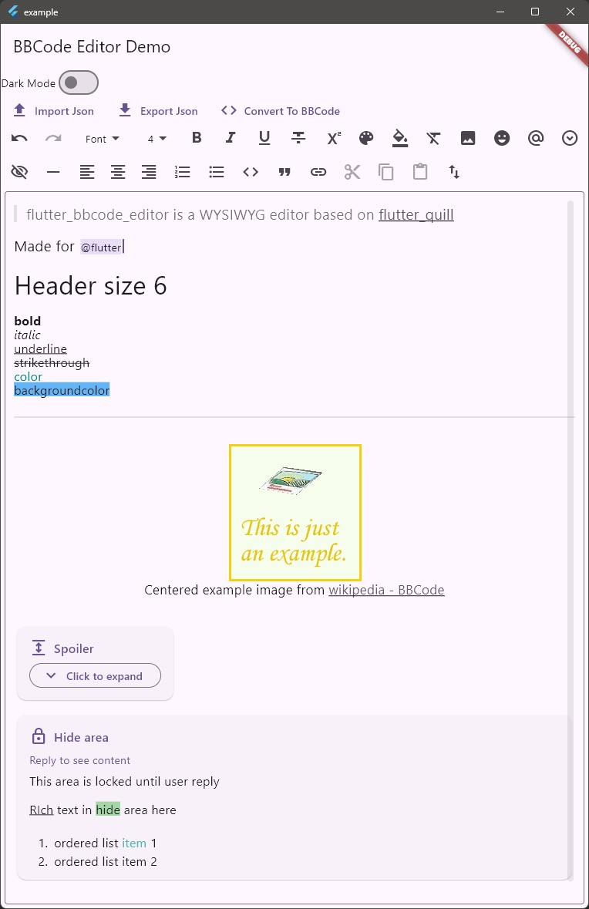

[English](../README.md) | 简体中文

# flutter_bbcode_editor

所见即所得的BBCode编辑器。

## 开发中

**当前仍处于开发状态。将来功能特性和API可能发生变动。**

## 截图



```
[quote][size=4]flutter_bbcode_editor is a WYSIWYG editor based on [/size][size=4][url=https://github.com/singerdmx/flutter-quill]flutter_quill[/url][/size]
[/quote]
[size=4]Made for [/size][@]flutter[/@]

[size=6]Header size 6[/size]

[b]bold[/b]
[i]italic[/i]
[u]underline[/u]
[s]strikethrough[/s]
[color=#087]color[/color]
[backcolor=#5ae]backgroundcolor[/backcolor]

[hr]

[spoiler=Click to expand][size=4]All[/size] [b]formats[/b] can be used in [b][color=#a4b]spoiler[/color][/b]

[list]
[*][color=#e99]unordered[/color] list item 1
[*][color=#e99]unordered[/color] list item 2
[/list]

[hide=1234]Hide area inside spoiler[/hide]
[/spoiler]

[hide]This area is locked until user reply

[u]RIch[/u] text in [backcolor=#9c9]hide[/backcolor] area here

[list=1]
[*]ordered list [color=#4aa]item[/color] 1
[*]ordered list item 2
[/list][/hide]
```

## 介绍

用来编辑[bbcode](https://en.wikipedia.org/wiki/BBCode)的Flutter widget，支持[所见即所得](https://en.wikipedia.org/wiki/WYSIWYG)。

基于[flutter_quill](https://pub.dev/packages/flutter_quill)。

## Feature

> 这些BBCode tag用于[TSDM](https://tsdm39.com/)论坛。
> 可以关掉。

* [ ] BBCode标签
  * ~~字体~~ *没有计划支持*
  * [x] 文字大小 `[size]` （1~7等级）
  * [x] 文字颜色 `[color=$color]`
  * [x] 粗体 `[b]`
  * [x] 斜体 `[i]`
  * [x] 下划线 `[u]`
  * [x] 删除线 `[s]`
  * [x] 背景色 `[backcolor=$color]`
  * [x] 上标 `[sup]`
  * [x] 对齐
    * [x] 居左 `[align=left]`
    * [x] 居中 `[align=center]`
    * [x] 居右 `[align=right]`
  * [x] 表情 `{:emoji_id:}`
  * [x] 链接 `[url]`
  * [x] 图片 `[img]`
    * 设置图片大小 `[img=$width,$height]$image_url[/img]`
  * [x] 折叠区域 `[spoiler]`
  * [x] 隐藏区域
    * [x] 要求回复 `[hide]` *用户回复后才显示*
    * [x] 积分高于特定值时才显示 `[hide=$points]` *只有那些积分高于$points的用户能看见*
  * [x] 提醒（艾特）用户 `[@]$user_name[/@]`
  * [x] 有序列表 `[list=1]`
  * [x] 无序列表 `[list]`
  * [x] 分隔线 `[hr]`
  * [ ] 表格 `[table]`
  * [x] 代码块 `[code]`
  * [x] 引用块 `[quote]`
* [ ] 源代码模式
* [x] 导出 **导出格式尚未稳定，未来的格式变更可能导致现有的导出数据无法再导入**
  * [x] 导出为BBCode
  * [x] 导出为quill delta
* [ ] 导入
  * [ ] 导入BBCode
  * [x] 导入quill delta
* [ ] 自定义标签
* [ ] 嵌套的block（ 代码块、引用、列表）
